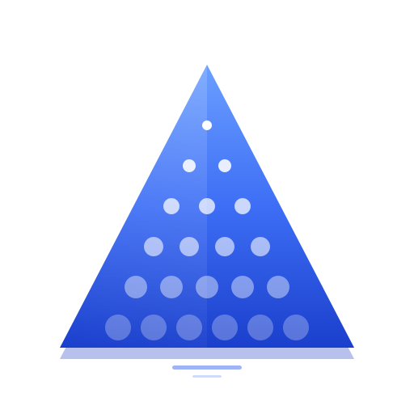
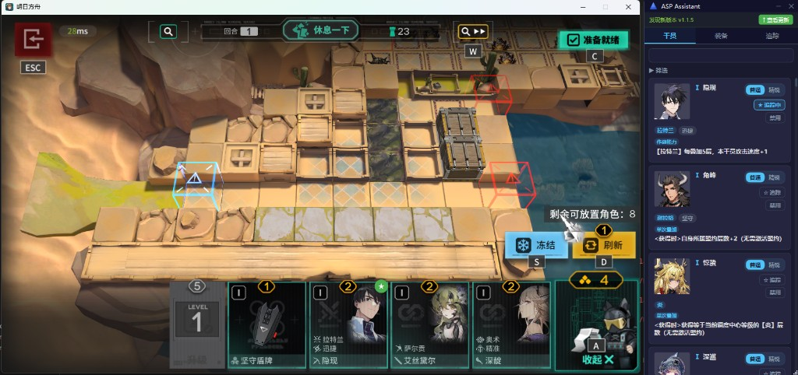

<div align="center">
  
  <h1>ASP Assistant</h1>
  <p>明日方舟·卫戍协议 实时辅助工具<br/>由 <a href="https://github.com/MaaXYZ/MaaFramework">MaaFramework</a> 强力驱动！</p>
  <p>
    
    
    
    
  </p>
</div>

---

## 截图



---

## 功能简介

ASP Assistant 是一款用于《明日方舟》**卫戍协议**玩法的透明悬浮侧边辅助工具，运行时叠加在游戏窗口上，提供以下功能：

### 干员浏览与筛选
- 按**星级**、**核心盟约（阵营）**、**附加盟约**、**特质类型**、**触发时机**多维度筛选
- 支持实时**名称搜索**
- 按**本局状态**（正常 / 禁用）过滤显示
- 可在每张干员卡片上手动**标记 / 取消标记**为禁用

### 截屏录入 Ban 位检测
- 点击"截屏录入"按钮，自动截取当前游戏窗口画面
- 通过 OCR 识别 Ban 选界面左侧阵营列表，缩小候选范围
- 使用 **MaaFramework FeatureMatch** + 皮肤头像模板，精准识别已 Ban 的干员
- 支持连续多次截屏排队执行，界面显示"X 录入任务执行中"进度提示

### 装备追踪
- 浏览全部装备数据，按盟约筛选
- 点击追踪按钮，将装备或干员加入本局追踪列表

### 游戏状态感知（OCR）
- 实时扫描识别商店物品、场上 / 备战区干员
- 自动统计当前盟约层数
- 在游戏画面上以**悬浮标记**高亮已追踪的目标

### 其他
- 自动检测新版本并弹出更新提示
- 窗口置顶、可自由拖动和缩放

---

## 运行要求

| 条件 | 说明 |
|------|------|
| 操作系统 | Windows 10 / 11（x64） |
| .NET 运行时 | [.NET 8 Desktop Runtime](https://dotnet.microsoft.com/download/dotnet/8.0) |
| 游戏客户端 | 明日方舟 PC 版（B 服 / 官服均可） |
| 游戏分辨率 | 推荐 16:9（1280×720 及以上） |

---

## 构建方法

```bash
# 克隆仓库
git clone <repo-url>
cd ASP_Assistant

# 拉取游戏数据（首次运行或版本更新后）
cd data
python fetch_spdatabase.py

# 下载皮肤头像模板（用于 Ban 位识别）
python fetch_spdatabase.py --download-skins

# 构建并运行
cd ..
dotnet run --project src/ASPAssistant.App
```

> **提示**：`fetch_spdatabase.py` 需要 Python 3.10+ 以及 `requests` 和 `Pillow` 库。
> ```bash
> pip install requests Pillow
> ```

---

## 数据文件说明

```
data/
├── operators.json          # 干员数据（含阵营、特质等）
├── equipment.json          # 装备数据
├── skin_avatar_map.json    # 皮肤头像 → 干员名映射（Ban 位识别用）
├── icons/
│   ├── operators/          # 干员头像（来自 PRTS Wiki）
│   └── skin_avatars/       # 皮肤头像（Ban 位识别模板）
└── fetch_spdatabase.py     # 数据拉取 / 皮肤下载脚本
```

### 常用脚本命令

| 命令 | 功能 |
|------|------|
| `python fetch_spdatabase.py` | 拉取最新干员 / 装备数据 |
| `python fetch_spdatabase.py --download-skins` | 下载皮肤头像并重建映射文件 |
| `python fetch_spdatabase.py --apply-mask` | 为现有皮肤头像补白色背景 |
| `python fetch_spdatabase.py --skip-icons` | 跳过头像下载，仅更新 JSON |

---

## 项目结构

```
src/
├── ASPAssistant.App/       # WPF 前端（Views、Windows、Resources）
├── ASPAssistant.Core/      # 业务逻辑（Services、ViewModels、Models、GameState）
└── ASPAssistant.Tests/     # 单元测试（xUnit + FluentAssertions）
```

---

## 开发依赖

- [MaaFramework](https://github.com/MaaAssistantArknights/MaaFramework) — 图像识别（OCR / TemplateMatch / FeatureMatch）
- [CommunityToolkit.Mvvm](https://github.com/CommunityToolkit/dotnet) — MVVM 基础设施
- [Newtonsoft.Json](https://www.newtonsoft.com/json) / `System.Text.Json` — JSON 序列化

---

## 许可证

本项目以 [Apache License 2.0](LICENSE) 开源，可自由使用、修改和分发，但须保留原始版权声明。

本项目仅供个人学习和使用，与 Hypergryph / 鹰角网络无关。
