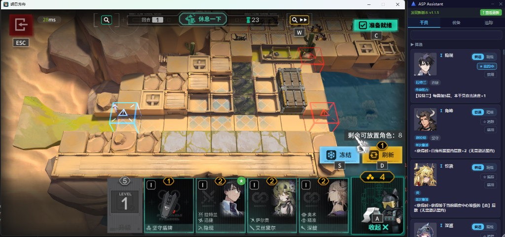

<div align="center">
  
  <h1>ASP Assistant</h1>
  <p>明日方舟·卫戍协议 实时辅助工具<br/>由 <a href="https://github.com/MaaXYZ/MaaFramework">MaaFramework</a> 强力驱动！</p>
  <p>
    
    
    
    
  </p>
</div>

---

## 截图



---

## 功能简介

ASP Assistant 是一款用于《明日方舟》**卫戍协议**玩法的透明悬浮侧边辅助工具，运行时叠加在游戏窗口上，提供以下功能：

### 干员浏览与筛选
- 干员与装备默认使用**左侧外扩**筛选布局。可通过标题栏齿轮打开**设置**，切换到顶部布局，切换时保留筛选条件和偏好。设置底部可查看当前版本和检查更新。
- 侧栏可展开、收起、按组折叠及重置。已选标签显示在筛选侧栏中，收起时保留数量提示。
- 盟约标签显示 PRTS 原图小图标（筛选区 16px、摘要和卡片 13px），离线可用；缺图或损坏时仍显示名称
- 干员默认按**等阶从低到高**排列，筛选后保持此顺序
- **等阶**、**核心盟约（阵营）**、**附加盟约**、**特质类型**、**触发时机**支持多选；同类标签匹配任意一项，不同类别同时满足
- **叠层**与**本局状态**保持单选；点击“全部”清空该类筛选，取消最后一个标签后自动回到“全部”
- 支持实时**名称搜索**
- 按**本局状态**（正常 / 禁用）过滤显示
- 可在每张干员卡片上手动**标记 / 取消标记**为禁用

### 核心与附加盟约自动禁用检测
- 自动检测“确认本局信息”准备页，不需要先添加追踪目标；侧栏顶部显示检测状态
- 保持顶部核心盟约及两行附加盟约完整可见，自动读取名称与图标状态：绿色可用，灰色且带阵容标记视为禁用，无需滚动到干员头像列表
- 有附加盟约的干员：**至少一个核心盟约被禁用，且至少一个附加盟约也被禁用**，才自动禁用
- 无附加盟约的干员：**总共只有一个核心盟约，且该核心被禁用**，才自动禁用；其他情况均不自动禁用
- 两部分识别完成后更新整份自动禁用名单；只改变附加盟约也会更新，识别不完整时保留已有名单并重试
- 识别完成后，筛选区与干员卡片中本局不可用的核心／附加盟约会淡化显示，悬停提示“本局禁用”；标签仍可筛选，清空记录或进入新局时重置标注
- 策略选择、自选编队页面保留结果；下方禁用头像列表不再作为识别入口
- 点击“截屏录入”可强制重扫当前盟约，识别不依赖干员皮肤头像模板
- 支持连续多次截屏排队执行，界面显示"X 录入任务执行中"进度提示
- 手动禁用/取消禁用会保留至清空或下一局；清空后，相同盟约状态不会立即重新填入，点击“截屏录入”可恢复自动结果

### 装备追踪
- 浏览全部装备数据，按**等阶**、**类型**多选筛选
- 点击追踪按钮，将装备或干员加入本局追踪列表

### 游戏状态感知（OCR）
- 实时扫描识别商店物品、场上 / 备战区干员
- 自动统计当前盟约层数
- 在游戏画面上以**悬浮标记**高亮已追踪的目标
- 商店追踪直接识别名称栏，干员和装备共用逻辑；支持同名多卡及分辨率缩放，不依赖皮肤颜色、立绘或卡框模板。职业图标干扰文字时会裁掉图标复读，并用完整名称库校验。
- 新皮肤保留商店布局时可直接使用；若名称栏位置或卡牌布局改变，需要调整识别区域和相对定位规则。

### 阵容搭配与分享
- 在**阵容**页签可新建、导入和管理多套阵容；顶部的**打开作业站**可在浏览器中打开卫戍阵容库。
- 独立编辑窗口支持搜索并选择 **1–10 名不重复干员**；填写阵容名称与**作者名称**后保存。
- 左侧可切换**干员 / 装备**页签，以每行 **3–4 个头像**展示目录。干员支持完整多选筛选（等阶、核心/附加盟约、特质类型、叠层、触发时机、本局状态），装备支持名称、等阶与类型筛选。
- 头像按批次在后台加载并跨窗口共享缓存，宫格仅创建可见行及少量预备行；加入/移除干员保留其余头像控件，搜索输入短暂合并后更新，减少开窗和面板操作时的卡顿。
- 将干员拖到右侧阵容区域加入，或双击/点击加入按钮；点击阵容头像后，在右下方统一编辑该干员。核心标记会显示在头像角落。
- 装备拖到干员头像上会填入空槽。拖到头像下的小装备槽，或右下编辑区的「装备一」「装备二」，可以指定槽位并替换现有装备。点击小图标右上角 **×** 可清除。
- 每名干员可分别标记为**叠层核心**、**输出核心**，允许多人担任、同一人兼任；每人有两个可选择、输入或清除的装备槽。
- 搭配完成后点**下一步**编辑阵容介绍。左侧编辑 Markdown 说明，右侧流程图可切换画布和源码。可把上方头像和装备拖入画布，用中键平移，或右键节点创建连线、删除节点。拖动位置只在当前编辑窗口内生效，保存后的预览使用自动布局。
- 阵容页可切换**全部阵容 / 我的阵容 / 导入阵容**。卡片右侧提供**预览、追踪、分享、上传**；右键卡片可编辑或删除。追踪可一次加入全部干员和已配置装备。
- 点击**分享**，作业站会生成并复制当前阵容的短链接。快照加密保存，有效期 90 天。需要公开发布时，在**设置 → 卫戍阵容库**登录，再点击卡片的**上传**。
- 复制短链接后，在桌面端点击**从剪切板导入**，或在作业站阵容编辑器中粘贴短链接。桌面端也兼容旧版分享文本。导入保留作者，并在**导入阵容**分类中创建新阵容。

### 其他
- 自动检测新版本并弹出更新提示
- 窗口置顶、可自由拖动和缩放

---

## 运行要求

| 条件 | 说明 |
|------|------|
| 操作系统 | Windows 10 / 11（x64） |
| 运行库 | 正式发布 ZIP 包自带 .NET 8 Desktop Runtime 和 x64 VC++ CRT；源码运行需要安装开发依赖 |
| 游戏客户端 | 明日方舟 PC 版（B 服 / 官服均可），或运行游戏的 Windows 安卓模拟器 |
| 游戏分辨率 | 推荐 16:9（1280×720 及以上） |

### 连接模拟器

1. 打开模拟器并进入明日方舟，在辅助工具的 **设置 → 游戏来源** 中选择 **选择游戏来源**。
2. MuMu 和雷电可直接从列表选择正在运行的实例。多开时根据实例名和编号选择，窗口重启后会重新查找已保存的实例。
3. 蓝叠、夜神、逍遥等可选择 **手动绑定 ADB**。选择模拟器窗口和其 ADB 程序，填写 `adb devices` 中对应的本机序列号。模拟器的 ADB 端口变更后，在这里更新序列号。

模拟器窗口在前台时，商店标记贴在游戏画面上。模拟器截图优先使用增强模式，可回退到普通 ADB 或窗口截图。ADB 未开启时也可通过窗口截图尝试识别，推荐使用横屏 16:9。

---

## 构建方法

```bash
# 克隆仓库
git clone <repo-url>
cd ASP_Assistant

# 拉取游戏数据（首次运行或版本更新后）
cd data
python fetch_spdatabase.py

# 构建并运行
cd ..
dotnet run --project src/ASPAssistant.App
```

> **提示**：`fetch_spdatabase.py` 需要 Python 3.10+ 以及 `requests` 和 `Pillow` 库。
> ```bash
> pip install requests Pillow
> ```

---

## 打包发布

使用 PowerShell 7，在项目根目录执行（将版本号换成本次发布版本）：

```powershell
dotnet test ASPAssistant.sln -c Release
python -B -m unittest discover -s tests
./scripts/publish.ps1 -Version 1.2.3 -OutputDirectory publish/win-x64
Compress-Archive -LiteralPath publish/win-x64 -DestinationPath publish/ASPAssistant-v1.2.3-win-x64.zip
```

打包机需安装 .NET 8 SDK 和 Visual Studio / Build Tools 的 C++ 工具。脚本自动查找 Visual Studio 的 x64 CRT 可再分发文件，将它们放到 `runtimes/win-x64/native` 的 Maa DLL 旁边，确保原生加载器能找到依赖；也可用 `-VcRedistDirectory` 指定 CRT 来源目录。找不到依赖、依赖架构错误或输出目录非空时会停止，避免生成不完整或夹带旧文件的包。重新打包请使用新的空目录。

GitHub 标签发布也调用同一个脚本。发布前需要提交全部代码和数据更新，包括 `covenants.json` 与新增图片；标签对应的提交必须包含这些文件。

发布包只包含 Windows x64 原生库、当前目录数据、浏览图片和 OCR 模型，不包含旧皮肤匹配模板、调试符号、Python 缓存或个人设置。皮肤下载脚本仍保留供开发参考。

### 用户数据与更新缓存

- 追踪设置：`%APPDATA%\ASPAssistant\tracking.json`。保存采用临时文件替换；损坏文件会保留为 `tracking.corrupt-*.json`，并恢复为空列表。
- 游戏来源：`%APPDATA%\ASPAssistant\game-target.json`。
- 阵容数据：`%APPDATA%\ASPAssistant\lineups.json`。采用临时文件替换保存；读取失败时显示提示并阻止覆盖，便于先备份、修复原文件。
- 应用日志和更新失败日志：`%APPDATA%\ASPAssistant\logs`。
- 更新临时目录：`%TEMP%\ASPAssistant-Update\<独立任务 ID>`。下载失败或安装结束后清理本次任务，不删除其他正在进行的更新。
- 将程序解压到当前用户可写的目录；更新前会检查目标目录写入权限。中文、空格及特殊字符路径均按字面值处理。

---

## 数据文件说明

```
data/
├── operators.json          # 干员数据（含阵营、特质等）
├── equipment.json          # 装备数据
├── skin_avatar_map.json    # 皮肤头像 → 干员名映射（Ban 位识别用）
├── source_metadata.json    # 赛季、抓取时间、上游修改时间及 SHA-256
├── icons/
│   ├── operators/          # 干员头像（来自 PRTS Wiki）
│   └── skin_avatars/       # 皮肤头像（Ban 位识别模板）
└── fetch_spdatabase.py     # 数据拉取 / 皮肤下载脚本
```

### 常用脚本命令

| 命令 | 功能 |
|------|------|
| `python fetch_spdatabase.py` | 拉取最新干员 / 装备数据 |
| `python fetch_spdatabase.py --download-skins` | 下载皮肤头像并重建映射文件 |
| `python fetch_spdatabase.py --apply-mask` | 为现有皮肤头像补白色背景 |
| `python fetch_spdatabase.py --skip-icons` | 跳过头像下载，仅更新 JSON |

当前默认拉取 **卫戍协议：规程**（`act3autochess / V3_1`）。旧赛季存档可用
`--season 2`（盟约上半）或 `--season 3`（盟约下半的存档版本）拉取；这些命令会替换当前本地数据。
上游文件的最后修改时间和本次抓取时间记录在 `data/source_metadata.json`，均带有时区信息。

---

## 项目结构

```
src/
├── ASPAssistant.App/       # WPF 前端（Views、Windows、Resources）
├── ASPAssistant.Core/      # 业务逻辑（Services、ViewModels、Models、GameState）
└── ASPAssistant.Tests/     # 单元测试（xUnit + FluentAssertions）
```

---

## 开发依赖

- [MaaFramework](https://github.com/MaaAssistantArknights/MaaFramework) — 图像识别（OCR / TemplateMatch / FeatureMatch）
- [CommunityToolkit.Mvvm](https://github.com/CommunityToolkit/dotnet) — MVVM 基础设施
- [Newtonsoft.Json](https://www.newtonsoft.com/json) / `System.Text.Json` — JSON 序列化

---

## 许可证

本项目以 [Apache License 2.0](LICENSE) 开源，可自由使用、修改和分发，但须保留原始版权声明。

本项目仅供个人学习和使用，与 Hypergryph / 鹰角网络无关。
